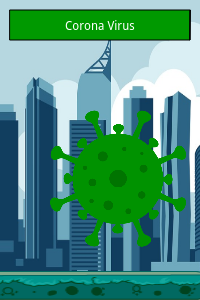

# Covid Battle

# How it works?

Covid Battle has two features, the RPG, and the Covid Alert.

## RPG

When the game starts, the players was 40 seconds to join. Being a Doctor, Nurse or a Scientist. After this, the game starts at players round.

The players has three commands to use:

1. - !attack | The Covid will be attack, taking a variable damage.
2. - !vacine | The covid will be attack, taking a variable damage and a bônus damages. Can be used for Doctors and Scientists one time in the match.
3. - !alcool | You enter in a defense position, taking less damage from Covid.
4. - !cure | You try to cure another infected person, who is no longer in the game. People with Doctor and Scientist classes can use this command one time in the match. But people with Nurse class can use this command several times during the match.

After players round, the Covid round will start. And all players will be attacked, taking a damage and can be infected. The game ends when the Covid is destructed, or when all players are infected.

## Covid Alert

Users from chat, in anytime, can use `!covid` and a country (with two letters, like US, BR, ES,etc), to show a alert in the screen and in the chat, with the Covid cases and recovered cases.

```
user: !covid es
bot: country ES have 3,107,172 Covid cases with 150,376 recovered cases
```


# Usage

Create a file named `.env` with yout authentication token and channel name, which can be acessed in [this site](https://twitchapps.com/tmi/).

```
TOKEN=yourtoken
CHANEL=yourchannel
```

After put your token, you can use the command `node index.js --chanel [YOUR CHANNEL]` to start the bot.

Now, you can enter in the address `http://localhost:3000` in your browser or OBS Browser overlay. To show a character of Covid and the life.


