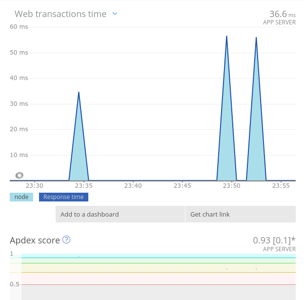
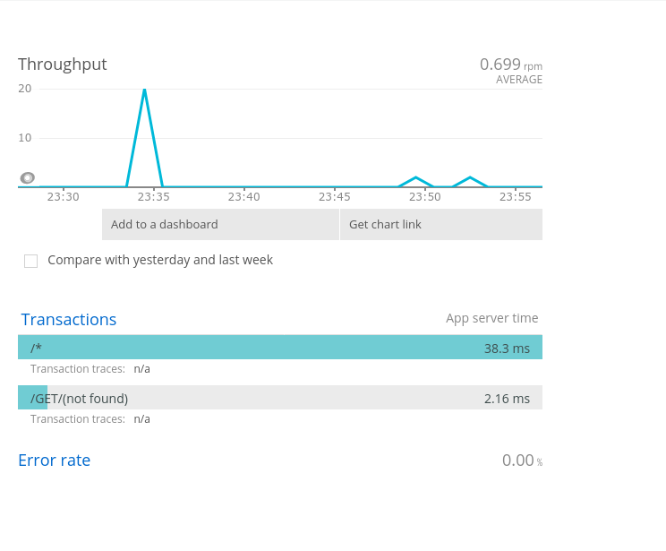

## What I built

Covid Battle is a RPG game and a bot for Streamers. You can play a Covid RPG with your viewers, and show the cases and recoveries cases of Covid19 in any country.

### Category Submission: 

Out of this World

### App Link

The app can be run only locally because it uses OBS overlay to show Covid's life and Covid Alert and it's repository is [here](https://github.com/tonhocodes/covidbattle)

### Screenshots


### Description

The app developed is called CovidBattle and it's goal is to battle against Covid19 in a fun way. CovidBattle has two features: RPG and Covid Alert.

#### RPG

When the game starts, players have 40 seconds to join, having to chose being a Doctor, Nurse or a Scientist. After this, the game starts at players round.

Players has three commands to use:

1. - !attack | Covid will be attacked, taking a variable level of damage.
2. - !vaccine | Covid will be attacked, taking a variable level damage and also bonus damages. Can be used for Doctors and Scientists once in the match.
3. - !alcohol | The player enter in a defense position, taking less damage from Covid.
4. - !cure | The player can try to cure another infected person who is no longer in the game. People with Doctor or Scientist classes can use this command once in the match,  while people with Nurse class can use this command several times.

After players round, the Covid round will start. And all players will be attacked, taking damage and also having the risk of getting infected. The game ends when Covid is destructed or when all players are infected.

#### Covid Alert

Users from chat, at any moment can use the command `!covid` followed by a two-letter country code, to show an alert in the screen and in the chat, with Covid cases and recoveries at the specified country.
```
user: !covid es
bot: country ES have 3,107,172 Covid cases with 150,376 recovered cases
```


### Link to Source Code

[Source Code Link](https://github.com/tonhocodes/covidbattle)

### Permissive License

This project is under MIT License:

MIT License

Copyright (c) 2020 Bruno Lopes

Permission is hereby granted, free of charge, to any person obtaining a copy
of this software and associated documentation files (the "Software"), to deal
in the Software without restriction, including without limitation the rights
to use, copy, modify, merge, publish, distribute, sublicense, and/or sell
copies of the Software, and to permit persons to whom the Software is
furnished to do so, subject to the following conditions:

The above copyright notice and this permission notice shall be included in all
copies or substantial portions of the Software.

THE SOFTWARE IS PROVIDED "AS IS", WITHOUT WARRANTY OF ANY KIND, EXPRESS OR
IMPLIED, INCLUDING BUT NOT LIMITED TO THE WARRANTIES OF MERCHANTABILITY,
FITNESS FOR A PARTICULAR PURPOSE AND NONINFRINGEMENT. IN NO EVENT SHALL THE
AUTHORS OR COPYRIGHT HOLDERS BE LIABLE FOR ANY CLAIM, DAMAGES OR OTHER
LIABILITY, WHETHER IN AN ACTION OF CONTRACT, TORT OR OTHERWISE, ARISING FROM,
OUT OF OR IN CONNECTION WITH THE SOFTWARE OR THE USE OR OTHER DEALINGS IN THE
SOFTWARE.

## Background

This project was created to help streamers to aware their audience about Covid19 risks in a funny way, by playing a RPG game, and also showing data about Covid19 in any country. I believe that the awareness created by this project could be important and helpful in decreasing Covid19 cases all over the world.

### How I built it 

It was built using NodeJS and Socket.io. New Relic's solutions were helpful to check the time of each request, the use of memory/cpu, and the duration of the bot run time. All of these parameters are very good to let you know if the code is running slowly or fast, or if it's consuming much memory, etc.

The data from Covid Battle's New Relic it's like this:




### Additional Resources/Info 

More information about the application and how to run it is presented in the video that was provided with this submission.

### In the process of building my “Out of this World” app, here’s what I learned about observability and technology in the fight against climate change…

I've learn how to use New Relic and see the inside of my app working in real time and also what to do with all the data observed regarding the improvement of the app's features.
